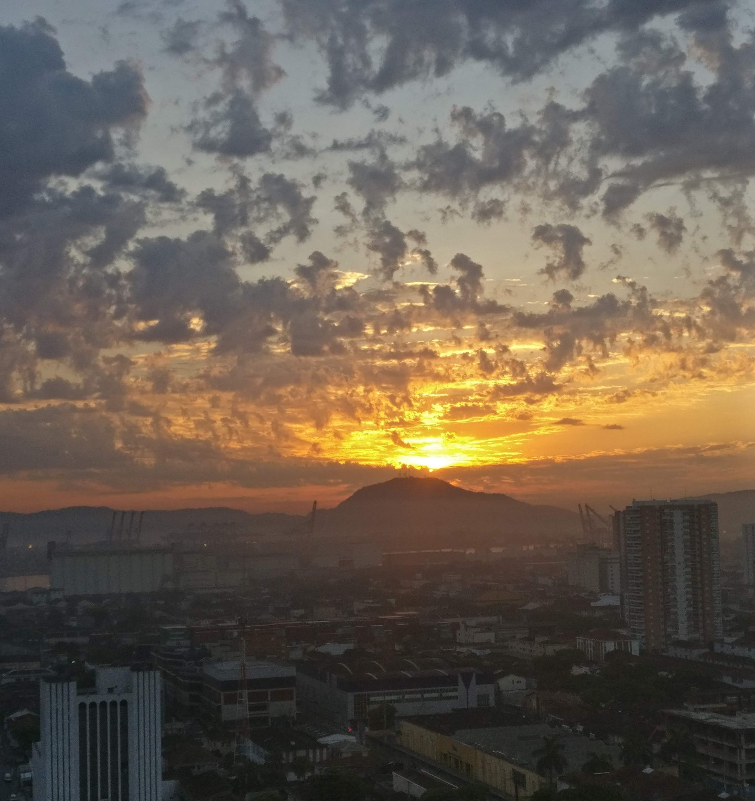
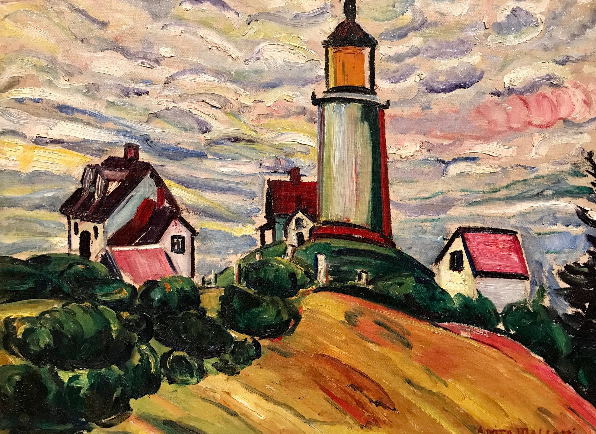
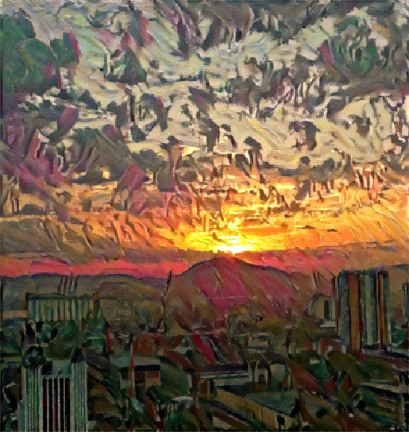

# Side project for the PyTorch Facebook Challenge Scholarship

 - https://sites.google.com/udacity.com/pytorch-scholarship-facebook/program-overview

## The project

The project consist in applying Style Transfer from one picture to another.

The content image was taken from the window of a building in Santos/SP - Brazil. In this picture, it is possible to see parts of the city, the port, and parts of Guarujá which is the neighboring city.



The style image is a painting from Anita Malfatti, who was a Brazillian artist, entitled "O farol" from 1915.
 - https://www.historiadasartes.com/sala-dos-professores/interpretacao-da-obra-o-farol-de-anita-malfatti/



## Code

The algorithm is taken straight from  class 6 - Style Transfer, from Udacity course.

The notebook was executed in Google Colaboratory. The first 3 cells denotes the first steps to take after importing the notebook to Colab.

The cell bellow will install the latest stable version of PyTorch

```
# http://pytorch.org/
from os.path import exists
from wheel.pep425tags import get_abbr_impl, get_impl_ver, get_abi_tag
platform = '{}{}-{}'.format(get_abbr_impl(), get_impl_ver(), get_abi_tag())
cuda_output = !ldconfig -p|grep cudart.so|sed -e 's/.*\.\([0-9]*\)\.\([0-9]*\)$/cu\1\2/'
accelerator = cuda_output[0] if exists('/dev/nvidia0') else 'cpu'

!pip install -q torch torchvision
```

Then the PIL package is updated to avoid compatibility errors.

```
!pip install PIL
```

The third cell is necessary only if you desire to save your work directly to Google Drive. I followed the steps in this article:
 -  https://medium.com/@ml_kid/how-to-move-our-model-from-google-colab-to-udacitys-workspace-final-lab-project-88e1a0b7d6ab

```
from google.colab import drive
drive.mount('/content/gdrive')
```

The following cells will apply the script from the class and generate a file named 'target.jpg' with the target image.

